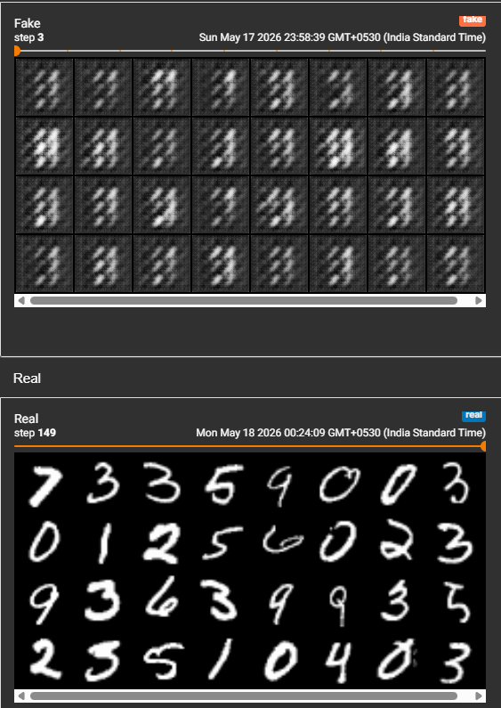
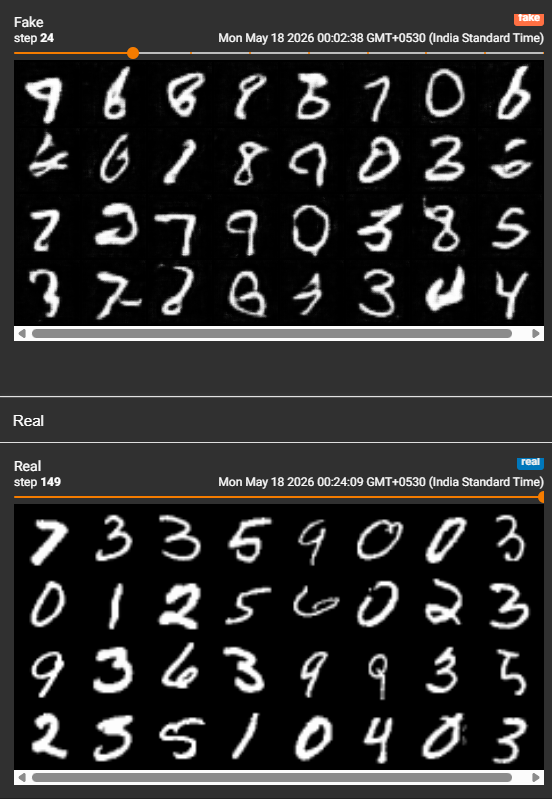
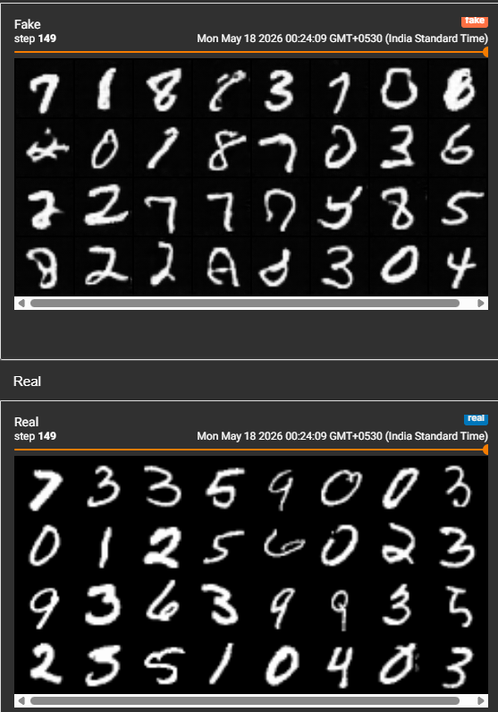

# DCGAN — MNIST

A from-scratch implementation of Deep Convolutional GAN (DCGAN) trained on MNIST using PyTorch, following the architecture guidelines from the original [Radford et al. 2016 paper](https://arxiv.org/abs/1511.06434).

Built as a direct follow-up to the Vanilla GAN implementation to address mode collapse and training instability.

---

## Results

### Early training (Step 3) — transient mode collapse
G initially collapsed to generating a single digit pattern. Unlike Vanilla GAN where this was permanent, DCGAN recovered within the first epoch due to BatchNorm stabilizing the adversarial balance.


### Stable training (Step 24 onwards)
By step 24, G was producing diverse, clearly readable digits across all 10 classes with no signs of collapse.


### Final output (Step 149)
Sharp, varied digits visually comparable to real MNIST samples.


---

## Vanilla GAN vs DCGAN — Comparison

| | Vanilla GAN | DCGAN |
|---|---|---|
| Architecture | Fully connected (Linear) | Conv2d / ConvTranspose2d |
| Mode collapse | Permanent from epoch ~300 | Transient, resolved by epoch 1 |
| Training stability | D dominated, G_loss exploded | Balanced throughout |
| Output quality | Noisy, blurry | Sharp, diverse |
| Batch size needed | 32 | 128 (smaller = collapse) |
| Weight init | PyTorch default | Normal(0, 0.02) per paper |
| BatchNorm | None | After every conv layer |

---

## What fixed the instability

- **BatchNorm** — normalizes activations between layers, keeps D and G competitive longer
- **Strided convolutions** — replaces MaxPooling, learnable downsampling in D
- **Transposed convolutions** — learnable upsampling in G, preserves spatial structure
- **Weight initialization** — Normal(mean=0, std=0.02) per DCGAN paper, more stable than PyTorch defaults
- **Larger batch size** — batch_size=32 caused immediate collapse; 128 provided sufficient BatchNorm statistics

---

## Architecture

### Discriminator
Input: `(N, 1, 64, 64)` grayscale image

```
Conv2d(1, 64, 4, 2, 1)       → (N, 64, 32, 32)   LeakyReLU(0.2)
Conv2d(64, 128, 4, 2, 1)     → (N, 128, 16, 16)  BatchNorm → LeakyReLU(0.2)
Conv2d(128, 256, 4, 2, 1)    → (N, 256, 8, 8)    BatchNorm → LeakyReLU(0.2)
Conv2d(256, 512, 4, 2, 1)    → (N, 512, 4, 4)    BatchNorm → LeakyReLU(0.2)
Conv2d(512, 1, 4, 2, 0)      → (N, 1, 1, 1)      Sigmoid
```

### Generator
Input: `(N, 100, 1, 1)` noise vector

```
ConvTranspose2d(100, 1024, 4, 1, 0)  → (N, 1024, 4, 4)    BatchNorm → ReLU
ConvTranspose2d(1024, 512, 4, 2, 1)  → (N, 512, 8, 8)     BatchNorm → ReLU
ConvTranspose2d(512, 256, 4, 2, 1)   → (N, 256, 16, 16)   BatchNorm → ReLU
ConvTranspose2d(256, 128, 4, 2, 1)   → (N, 128, 32, 32)   BatchNorm → ReLU
ConvTranspose2d(128, 1, 4, 2, 1)     → (N, 1, 64, 64)     Tanh
```

---

## Training

| Hyperparameter | Value |
|---|---|
| Epochs | 30 |
| Batch size | 128 |
| Noise dim (z) | 100 |
| Learning rate | 0.0002 |
| Optimizer | Adam (β1=0.5, β2=0.999) |
| Loss function | BCELoss |
| Image size | 64×64 |
| Weight init | Normal(0, 0.02) |

---

## Stack

Python, PyTorch, torchvision, TensorBoard, Matplotlib
